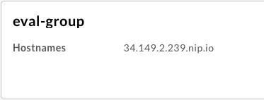
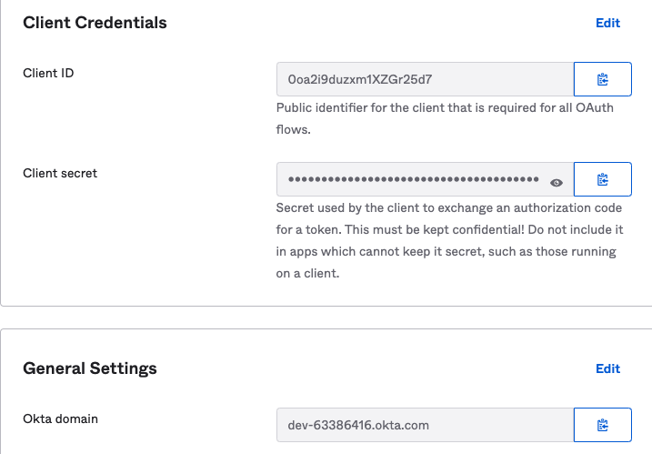

id: idp-okta-integration

# Apigee IDP integraiton with Okta

## Introduction

Welcome to the lab on  **Apigee Integration with Okta**!


The goal of this lab is to walk you through configuring and using the [Apigee Identity Facade](https://github.com/apigee/devrel/tree/main/references/identity-facade) to integrate with [Okta](www.okta.com) and authenticate users.


We assume the basic knowledge of Apigee platform and you will get the most from
this hackathon if you do.

Ideally you will have completed the Coursera Apigee
[Design](https://www.coursera.org/learn/api-design-apigee-gcp),
[Development](https://www.coursera.org/learn/api-development-apigee-gcp) and
[Security](https://www.coursera.org/learn/api-security-apigee-gcp) Courses.

Alternatively, completing the Apigee [API Jam](https://github.com/apigee/apijam)
will cover the same topics in less depth.

Lets get started!


## Flow

- Application developers use the Apigee Developer Portal to register and retrieve API keys
- Application developers use Okta Developer Portal to create A
- Client applications accessing public API hosted on Apigee will use HTTPS and
  API keys, and OAuth 2.0 access tokens from Okta
- Apigee communicates with target applications over TLS

## Prerequisites
- [Signup](https://developer.okta.com/signup/) for an Okta developer account
- Create an [Apigee Eval](https://cloud.google.com/apigee/docs/api-platform/get-started/eval-orgs) organization

### Tools

Here are the tools needed to complete the tasks:

- Web Browser (recent version of [Chrome](https://www.google.com/chrome/) or
  [Firefox](https://www.mozilla.org/en-GB/firefox/new/))
- [Git](https://git-scm.com/book/en/v2/Getting-Started-Installing-Git)
- [Maven](https://maven.apache.org/install.html)
- A REST Client - [Postman](https://www.postman.com/) or
  [Curl](https://curl.haxx.se/)


## Okta setup

### Retrieve Apigee URL
The URL configured in the Apigee Environment group is needed so Okta can be configured with the correct redirection settig.

Use Apigee UI
1. Open the [Apigee Portal](https://apigee.google.com)
2. Expand Admin - Environments and click on Groups
3. Copy the Hostname(s)
     * Note that eval organization have a default hostname of {publicip}.nip.io. ex: 34.149.2.239.nip.io




### Create Okta User
1. Sign into your Okta developer portal
2. In the left hand side  navigate to Directoy - People
3. Click on **Add person**
     * A valid email is not needed if the Password is set by Admin

     
4. Click **Save**

### Create Okta App
1. In the left hand side navigate to Applications - Applications
2. Click on **Create App Integration**
3. In the window that opens, selecte OIDC - OpenID Connect and Web Application and click **Next** to create the App

4. In the next screen, configure the following
- App integration name: Apigee App
- Sign-in redirect URIs: https://{env group hostname}/v1/oauth20/callback 
     - example: https://34.149.2.239.nip.io/v1/oauth20/callback
     - This url points to the idp facade that will be deployed to Apigee
     - Controlled access: Allow everyone...


5. Click **Save** to be taken to the properties of the Okta app just created


6. Save the Client ID, Client secret, and Okta domain as environment variables
```
export TEST_IDP_APIGEE_CLIENT_ID=0oa2hu6lb5HPR37fY5d7
export TEST_IDP_APIGEE_CLIENT_SECRET=veERjgCwQ9KUGLidVevKjAwywxX2JBhmg1iQ88gd
export IPD_HOSTNAME=dev-63386416.okta.com
```


## Identity Facade Setup

1. In a command line, clone the [devrel repo](https://github.com/apigee/devrel)

```
git clone https://github.com/apigee/devrel.git
```

2. Navigate to the identity facade directory
     
```
cd devrel/references/identity-facade
```
3. Run the following commands to set the environment variables required for the setup

```
export IDP_DISCOVERY_DOCUMENT="https://$IPD_HOSTNAME/.well-known/openid-configuration"
export APIGEE_X_ORG=teodlh-apigeex
export APIGEE_X_ENV=eval
export APIGEE_X_HOSTNAME=34.149.2.239.nip.io
```
4. Verify the variables have been set correctly

```
echo $IDP_DISCOVERY_DOCUMENT
echo $TEST_IDP_APIGEE_CLIENT_ID
echo $TEST_IDP_APIGEE_CLIENT_SECRET
echo $APIGEE_X_ORG
echo $APIGEE_X_ENV
echo $APIGEE_X_HOSTNAME
````

5. Deploy the identity facade

```./pipeline.sh --googleapi```

- The output is show below. The values for consumerKey and consumerSecret are from the Apigee identityApp that was created as part of the Identity Facade deployment. 
     
6. Copy and save the following values:

- consumerKey
- consumerSecret
- authorization URL

7. Finally, generate environment variables for use later.

- Base64 encoding of client id and secret for use during Basic Auth in tests
```
export APIGEE_CLIENT_ID=xkey-1636042329
export APIGEE_SECRET=xsecret
export BASE64_ENCODED=$(echo -n $APIGEE_CLIENT_ID:$APIGEE_SECRET | base64)
```


## Test Identity Facade

This test will simulate a three-legged [OAuth 2.0](https://cloud.google.com/apigee/docs/api-platform/security/oauth/oauth-introduction) flow / authorization grant

1. Open an incognito tab in a browser and visit the **authorization URL** captured above
- This step simulates an application attempting to authenticate against the Apigee Identity Facade. 
- You can generate the authorization url using the command below.
     ```
     export AUTH_URL="https://$APIGEE_X_HOSTNAME/v1/oauth20/authorize?client_id=$APIGEE_CLIENT_ID&response_type=code&scope=openid email profile&state=abcd-1234&redirect_uri=https://httpbin.org/get"
     echo $AUTH_URL
     ```

2. Apigee will redirect to Okta to generate an authorization code. Log in using the Okta credentials for the user created earlier.
    

3. The authorization URL has Okta redirect to httpbin.org which is a 3rd party service that will show payload from Okta. Specifically, we need the authorization code.
- In a real-world scenario, the redirection would be back to the client application and it would parse Okta's response to capture the authorization code


4. Pass the authorization code, client id, and base64 encoded string to Apigee Identity Facade to generate a Bearer token that will be used for API calls.
```
export AUTH_CODE={authorization code returned above}
export AUTH_CODE=Eln3eawlSIOiPBjNX2kzA7WMjd7fIYxXRudvbmQiF9Y
export APIGEE_RESPONSE=$(curl -s --location --request POST "https://$APIGEE_X_HOSTNAME/v1/oauth20/token?client_id=$APIGEE_CLIENT_ID" \
--header "Authorization: Basic $BASE64_ENCODED" \
--header 'Content-Type: application/x-www-form-urlencoded' \
--data-urlencode 'redirect_uri=https://httpbin.org/get' \
--data-urlencode 'grant_type=authorization_code' \
--data-urlencode "code=$AUTH_CODE")
echo $APIGEE_RESPONSE
export ACCESS_TOKEN=$(echo $APIGEE_RESPONSE | jq -r .access_token)
echo $ACCESS_TOKEN
```
5. Apigee will respond with a Bearer token (access_token) which is saved to an environment variable


6. Finally, call an endpoint protected by OAuth. The identity facade has one configured.

```
curl --location --request GET "https://$APIGEE_X_HOSTNAME/v1/oauth20/protected" \
--header "Authorization: Bearer $ACCESS_TOKEN"
```


## Use Identity Facade with API Proxy

The default Apigee install includes a /hello-world proxy. In this section we will add an OAuthv2 policy that verifies the access token and create an application that has access to the identity facade (generate tokens) and the Hellow-World proxies.

1. In the Apigee portal, expand Publish and click on API Products.
2. Choose + CREATE
3. Fill in the following

- Name: Hellow World
- Display Name: Hello World
- Environment: eval
- Access: Public
- Operations (ADD AN OPERATION)
     - API Proxy: hello-world
     - Path: /
     - Save
- Scroll up and click Save


    

3. Under Public, click on Apps
- Notice there is an app created called identity app. The client id and secret used above are from this application. 
4. Click on +App and configure it as follows:
- Name: Hello World App
- Developer: Jane Doe (this user was also created during the identity facade deployment)
- Productt:
     - Hello World
     - Identity Facade


5. Click Create
6. Copy the values for Key (client ID) and Secret


7. Update the environment variables
```
export APIGEE_CLIENT_ID=F3gGHZGtPPg6FcZqo0JwXFbV2NVkW0ILOXKte9HMFWJsOgR8
export APIGEE_SECRET=3m5VFXhQIcMO45dhK8YZ85Svw97iTIdiuBnIQMSPJQrZHQQrkQ1aPsYJ3gWVec41
export BASE64_ENCODED=$(echo -n $APIGEE_CLIENT_ID:$APIGEE_SECRET | base64)
export AUTH_URL="https://$APIGEE_X_HOSTNAME/v1/oauth20/authorize?client_id=$APIGEE_CLIENT_ID&response_type=code&scope=openid email profile&state=abcd-1234&redirect_uri=https://httpbin.org/get"
echo "$AUTH_URL"
```


8. Like before, visit the $AUTH_URL in a browser
- Authenticate as testuser@testdomain.com
- Copy the authorization code from the response


9. Run through the remaning authentication and API call steps
```
export AUTH_CODE={authorization code returned above}
export AUTH_CODE=9_KUjy0fntEvhopMAL9OCz2SNNZPSXqDZGYAzmfYus0
export APIGEE_RESPONSE=$(curl -s --location --request POST "https://$APIGEE_X_HOSTNAME/v1/oauth20/token?client_id=$APIGEE_CLIENT_ID" \--header "Authorization: Basic $BASE64_ENCODED" \
--header 'Content-Type: application/x-www-form-urlencoded' \
--data-urlencode 'redirect_uri=https://httpbin.org/get' \
--data-urlencode 'grant_type=authorization_code' \
--data-urlencode "code=$AUTH_CODE")

export ACCESS_TOKEN=$(echo $APIGEE_RESPONSE | jq -r .access_token)

curl --location --request GET "https://$APIGEE_X_HOSTNAME/hello-world" \
--header "Authorization: Bearer $ACCESS_TOKEN"
```


## Summary
Congratulations! You've now successfully integrated your Apigee environment with a 3rd party IDP, Okta, and secured your API using OAuthv2 tokens.

