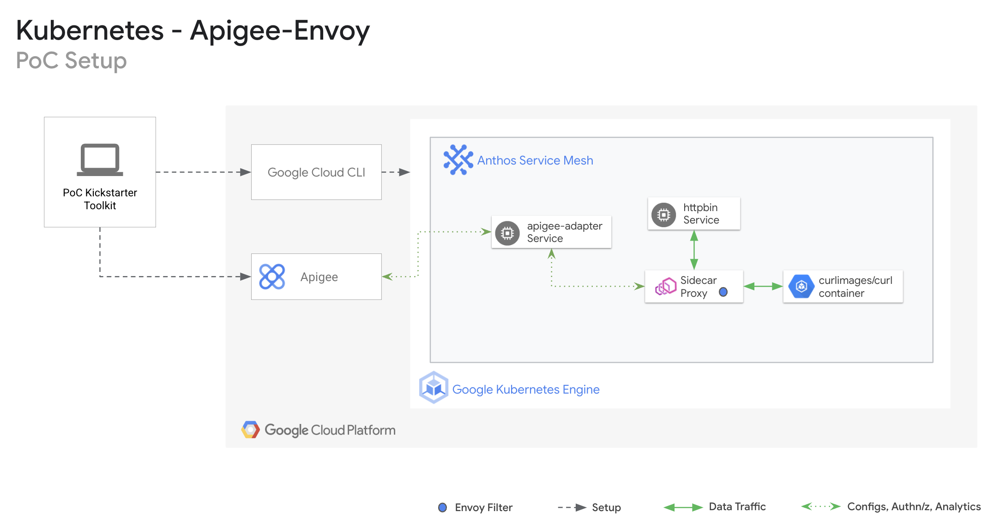
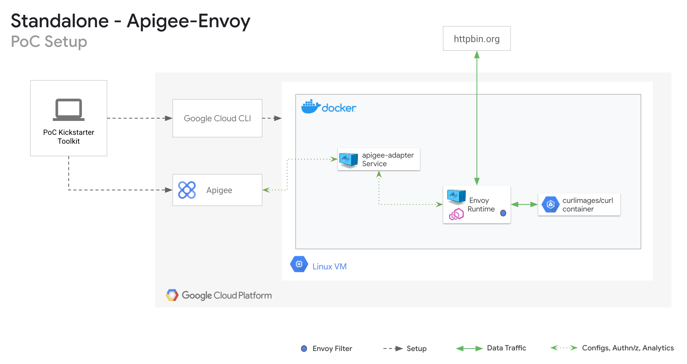
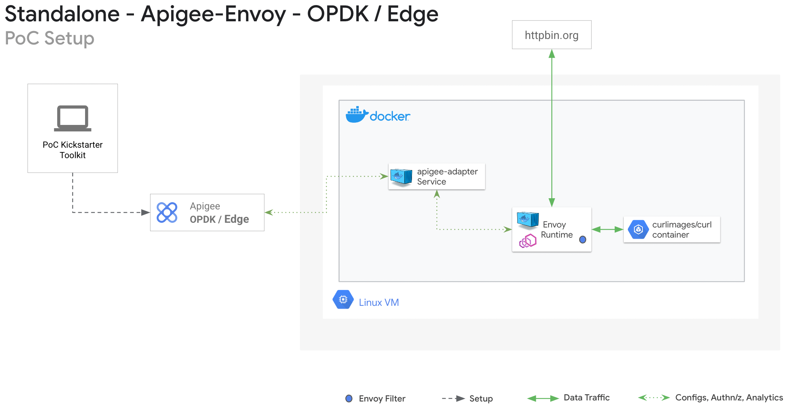

# Apigee Envoy Quickstart Toolkit

The Apigee Envoy Quickstart Toolkit sets up the Envoy proxies with Apigee adapters. 

* [Envoy with Apigee adapter as containers within Kubernetes platform for Apigee X/Hybrid](#envoy-with-apigee-adapter-as-containers-within-kubernetes-platform)
* [Envoy with Apigee adapter as native docker containers for Apigee X/Hybrid](#envoy-with-apigee-adapter-as-native-docker-containers-for-apigee-xhybrid)
* [Envoy with Apigee adapter as docker containers for OPDK/Edge](#envoy-with-apigee-adapter-as-docker-containers-for-opdkedge)

## Envoy with Apigee adapter as containers within Kubernetes platform  
<br/>

[Apigee protected ASM Envoy Proxies within Kubernetes Engine](https://cloud.google.com/apigee/docs/api-platform/envoy-adapter/latest/example-hybrid).



### Prerequisites

1. **[Create a Google Cloud Project](https://cloud.google.com/resource-manager/docs/creating-managing-projects)** and connect it to an existing Billing account.

1. **(For the Kubernetes environment demo) Setup a GKE cluster. Have the cluster enabled with Anthos Service Mesh. Checkout this **[gke poc toolkit](https://github.com/GoogleCloudPlatform/gke-poc-toolkit)** to standup a GKE cluster via automation with ASM enabled.**

1. **If your GKE cluster is version 1.25+ follow this **[link](https://cloud.google.com/blog/products/containers-kubernetes/kubectl-auth-changes-in-gke)** for enabling required changes for kubectl authentication**

1. **The GCP Apigee project should be enabled for service-account key generation.**

1. **This toolkit is validated in a Linux environment. Needed libraries : wget, jq.**

### Installation - X/Hybrid platform

1. **Set your GCP Project ID, Apigee platform environment variables.** 
    ```bash
    export PROJECT_ID=<your-project-id>
    export CLUSTER_NAME=<gke-cluster-name>
    export CLUSTER_LOCATION=<gke-cluster-region>
    export APIGEE_PROJECT_ID=<apigee-project-id>
    export APIGEE_X_ORG=<apigee-org>
    export APIGEE_X_ENV=<apigee-env>
    export APIGEE_X_HOSTNAME=<env-group-virtualhost-prefixed with http/https>
    export APIGEE_REMOTE_SRVC_CLI_VERSION=<version for Apigee Remote Service cli for Envoy>
    export APIGEE_REMOTE_SRVC_ENVOY_VERSION=<version for Apigee Remote Service for Envoy>
    ```
    When specifying the version numbers, ignore the 'v' prefix and use just the number.
    
    Latest cli version can be found **[here](https://github.com/apigee/apigee-remote-service-cli/releases/latest)**. Please ignore the prefix "v" and just use the version number.<br />
    Latest apigee-envoy version can be found **[here](https://github.com/apigee/apigee-remote-service-envoy/releases/latest)**

1. **Set up local authentication to your project.**
    ```bash
    gcloud config set project $APIGEE_PROJECT_ID
    gcloud auth application-default login --no-launch-browser

    export TOKEN=$(gcloud auth print-access-token)
    ```

1. **Set apigee-envoy home directory where the tool will be executed and the binaries will be loaded**
    ```bash
    mkdir apigee-envoy-toolkit && cd "$_"
    export ENVOY_HOME=$(pwd)
    ```

1. **Clone Apigee DevRel repository, if not exists.** 
    ```bash
    git clone https://github.com/apigee/devrel.git
    ```

1. **Set the devrel project location**
    ```bash
    export DEVREL_HOME=<cloned-devrel-directory>
    ```

1. **Run to install the quickstart toolkit.**
    ```bash
    cd ${DEVREL_HOME}/tools/apigee-envoy-quickstart/
    ./aekitctl.sh --type istio-apigee-envoy --action install
    ```

1. **On successful run, it displays the commands (kubeclt run, curl) to validate the traffic intiated to the Envoy endpoints being protected by Apigee Adapter service.**

### Cleanup
1. **Run to cleanup the PoC setup from the GKE and Apigee platform**
    ```bash
    cd ${ENVOY_HOME}/apigee-envoy-quickstart-main
    ./aekitctl.sh --type istio-apigee-envoy --action delete
    ```

## Envoy with Apigee adapter as native docker containers for Apigee X/Hybrid  

[Apigee protected Envoy Proxies in docker containers](https://cloud.google.com/apigee/docs/api-platform/envoy-adapter/latest/example-apigee).



### Prerequisites  

1. **The GCP Apigee project should be enabled for service-account key generation.**

1. **This toolkit is validated in a Linux environment. Needed libraries : wget, jq.**

### Installation - X/Hybrid platform

1. **Set your GCP Project ID, Apigee platform environment variables.** 
    ```bash
    export APIGEE_PROJECT_ID=<apigee-project-id>
    export APIGEE_X_ORG=<apigee-org>
    export APIGEE_X_ENV=<apigee-env>
    export APIGEE_X_HOSTNAME=<env-group-virtualhost-prefixed with http/https>
    export APIGEE_REMOTE_SRVC_CLI_VERSION=<version for Apigee Remote Service cli for Envoy>
    export APIGEE_REMOTE_SRVC_ENVOY_VERSION=<version for Apigee Remote Service for Envoy>
    ```
    Latest cli version can be found **[here](https://github.com/apigee/apigee-remote-service-cli/releases/latest)**<br />
    Latest apigee-envoy version can be found **[here](https://github.com/apigee/apigee-remote-service-envoy/releases/latest)**

1. **Set up local authentication to your project.**
    ```bash
    gcloud config set project $APIGEE_PROJECT_ID
    gcloud auth application-default login --no-launch-browser

    export TOKEN=$(gcloud auth print-access-token)
    ```

1. **Set apigee-envoy home directory where the tool will be executed and the binaries will be loaded**
    ```bash
    mkdir apigee-envoy-toolkit && cd "$_"
    export ENVOY_HOME=$(pwd)
    ```

1. **Clone Apigee DevRel repository, if not exists.** 
    ```bash
    git clone https://github.com/apigee/devrel.git
    ```

1. **Set the devrel project location**
    ```bash
    export DEVREL_HOME=<cloned-devrel-directory>
    ```

1. **Run to install the quickstart toolkit.**
    ```bash
    cd ${DEVREL_HOME}/tools/apigee-envoy-quickstart/
    ./aekitctl.sh --type istio-apigee-envoy --action install
    ```

1. **On successful run, it displays the commands (kubeclt run, curl) to validate the traffic intiated to the Envoy endpoints being protected by Apigee Adapter service.**

### Cleanup

1. **Run to cleanup the PoC setup from the GKE and Apigee platform**
    ```bash
    cd ${ENVOY_HOME}/apigee-envoy-quickstart-main
    ./aekitctl.sh --type standalone-apigee-envoy --action delete
    ```

## Envoy with Apigee adapter as docker containers for OPDK/Edge  

[Apigee protected Envoy Proxies in docker containers for OPDK platform](https://docs.apigee.com/api-platform/envoy-adapter/latest/example-edge).



### Prerequisites  

1. **The GCP Apigee project should be enabled for service-account key generation.**

1. **This toolkit is validated in a Linux environment. Needed libraries : wget, jq.**
 
### Installation - OPDK / Edge platform

1. **Set environment variables for OPDK.**
    ```bash
    export MGMT_HOST=<Mgmt host of the opdk platform, including the http/https and port number>
    export APIGEE_USER=<Mgmt host credential, username>
    export APIGEE_PASS=<Mgmt host credential, password>
    export APIGEE_ORG=<apigee-org>
    export APIGEE_ENV=<apigee-env>
    export APIGEE_X_HOSTNAME=<virtualhost-uri-prefixed with http/https>
    export APIGEE_REMOTE_SRVC_CLI_VERSION=<version for Apigee Remote Service cli for Envoy>
    export APIGEE_REMOTE_SRVC_ENVOY_VERSION=<version for Apigee Remote Service for Envoy>
    ```

1. **Set environment variables for EDGE.**
    ```bash
    export MGMT_HOST=<Mgmt host of the opdk platform, including the http/https and port number>
    export APIGEE_USER=<Mgmt host credential, username>
    export APIGEE_PASS=<Mgmt host credential, password>
    export APIGEE_ORG=<apigee-org>
    export APIGEE_ENV=<apigee-env>
    export APIGEE_REMOTE_SRVC_CLI_VERSION=<version for Apigee Remote Service cli for Envoy>
    export APIGEE_REMOTE_SRVC_ENVOY_VERSION=<version for Apigee Remote Service for Envoy>
    ```

1. **Set apigee-envoy home directory where the tool will be executed and the binaries will be loaded**
    ```bash
    mkdir apigee-envoy-toolkit && cd "$_"
    export ENVOY_HOME=$(pwd)
    ```

1. **Clone Apigee DevRel repository, if not exists.** 
    ```bash
    git clone https://github.com/apigee/devrel.git
    ```

1. **Set the devrel project location**
    ```bash
    export DEVREL_HOME=<cloned-devrel-directory>
    ```

1. **Run to install the quickstart toolkit for opdk.**
    ```bash
    cd ${DEVREL_HOME}/tools/apigee-envoy-quickstart/
    ./aekitctl.sh --type istio-apigee-envoy --action install --platform opdk
    ```

1. **Run to install the quickstart toolkit for edge.**
    ```bash
    cd ${DEVREL_HOME}/tools/apigee-envoy-quickstart/
    ./aekitctl.sh --type standalone-apigee-envoy --action install --platform edge
    ```

1. **On successful run, it displays the commands (kubeclt run, curl) to validate the traffic intiated to the Envoy endpoints being protected by Apigee Adapter service.**

### Cleanup

1. **Run to cleanup the PoC setup from OPDK Apigee platform**
    ```bash
    cd ${ENVOY_HOME}/apigee-envoy-quickstart-main
    ./aekitctl.sh --type standalone-apigee-envoy --action delete --platform opdk
    ```

1. **Run to cleanup the PoC setup from Edge Apigee platform**
    ```bash
    cd ${ENVOY_HOME}/apigee-envoy-quickstart-main
    ./aekitctl.sh --type standalone-apigee-envoy --action delete --platform edge
    

