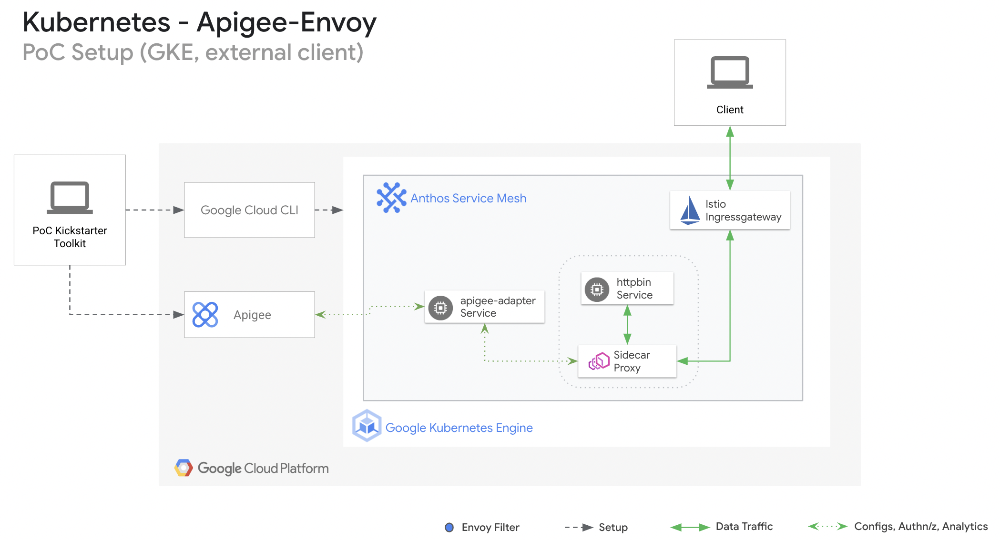

# Apigee Envoy extension (for external access)

This is an extension to the starter setup of apigee-envoy deployment within GKE container platform with Apigee X/Hybrid as API management platform. 

The starter kit deploys httpbin service configured with Envoy proxies as side car proxies. The Envoy proxy is enabled with apigee-adapter as step in the request path enforcing  Apigee provided authentication methods.

This extension enables the expose of deployed sample application (httpbin) externally via istio-ingressgateway. It showcases apigee enabled envoy proxies can offer protection of api traffic intiated externally. 



### Pre-requisities:

1. Deployment of starter  setup of apigee-envoy deployment within Istio enabled Kubernetes platform. 

### Installation:

1. **Set your GCP Project ID, Apigee platform environment variables.** 
    ```bash
    export PROJECT_ID=<your-project-id>
    export CLUSTER_NAME=<gke-cluster-name>
    export CLUSTER_LOCATION=<gke-cluster-region>
    export APIGEE_PROJECT_ID="x-project-1-344916"
    ```

1. **Set up local authentication to your project.**
    ```bash
    gcloud config set project $PROJECT_ID
    gcloud auth application-default login --no-launch-browser

    export TOKEN=$(gcloud auth print-access-token)
    ```

1. **Download the Apigee Envoy PoC Toolkit binary. If already present during the apigee-envoy setup, this step can be skipped** 
    ```bash
    mkdir apigee-envoy-toolkit && cd "$_"
    export ENVOY_HOME=$(pwd)
    wget -O devrel.zip https://github.com/apigee/devrel/archive/refs/heads/main.zip
    unzip devrel.zip
    mv devrel-main apigee-devrel
    rm devrel.zip
    ```
1. **Run to install the quickstart toolkit.**
    ```bash
    cd ${ENVOY_HOME}/apigee-devrel/tools/apigee-envoy-quickstart/extension
    ./setup-external-access.sh
    ```


